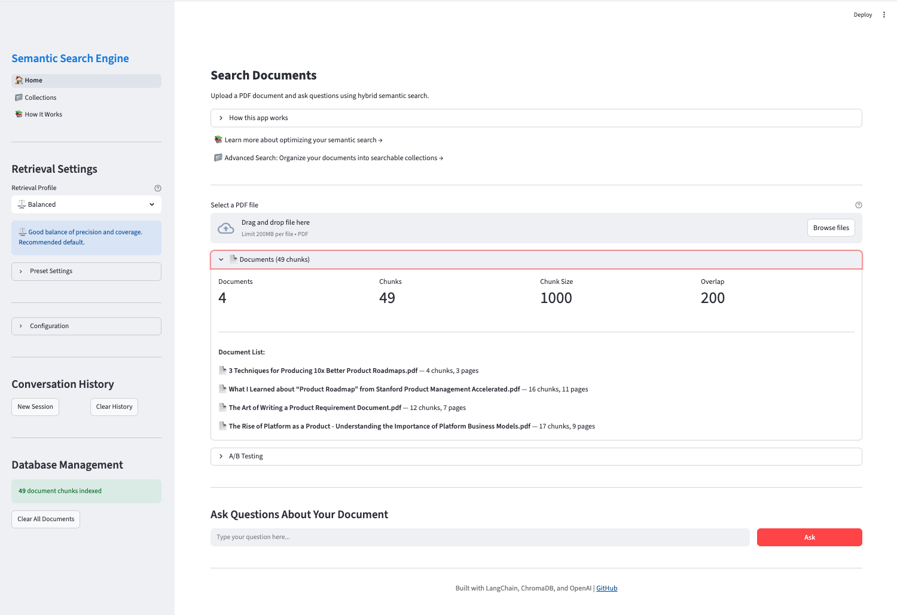
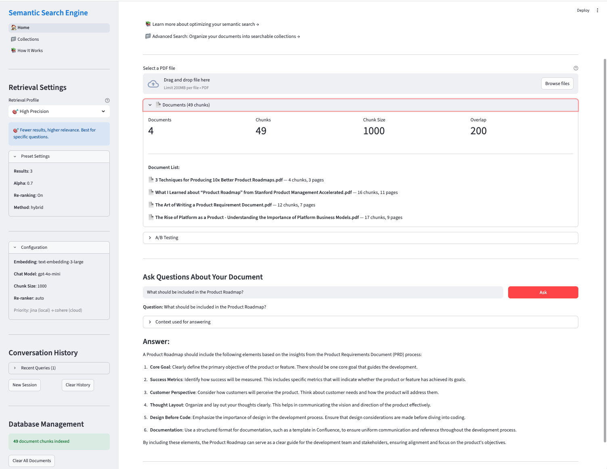
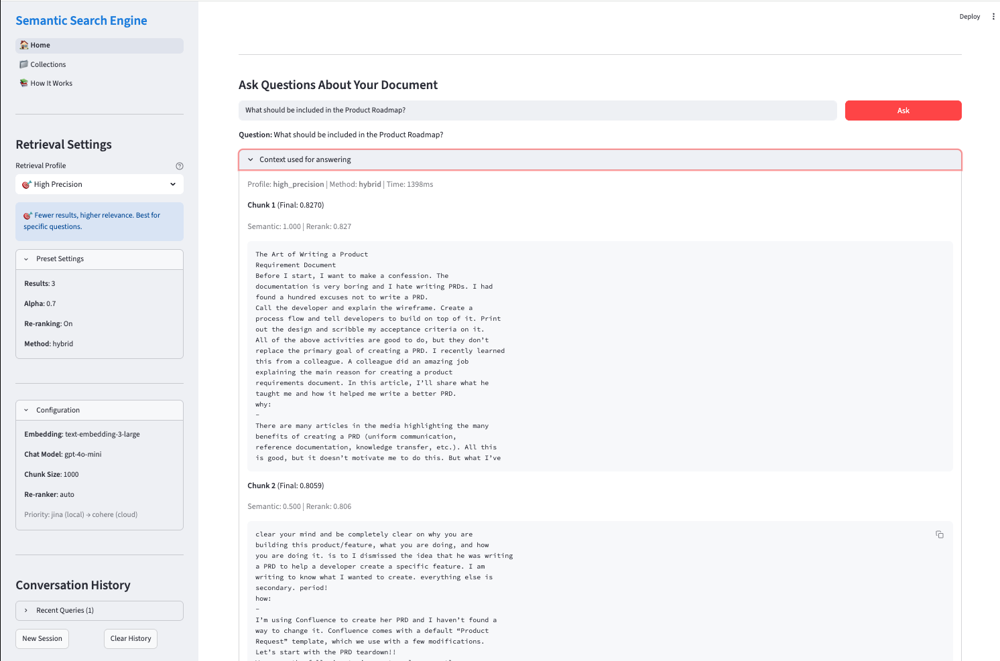
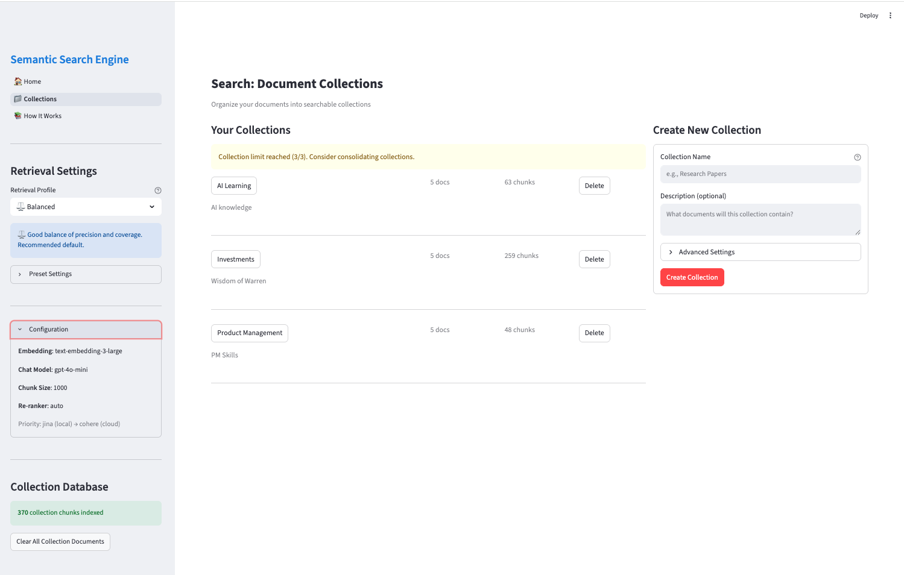
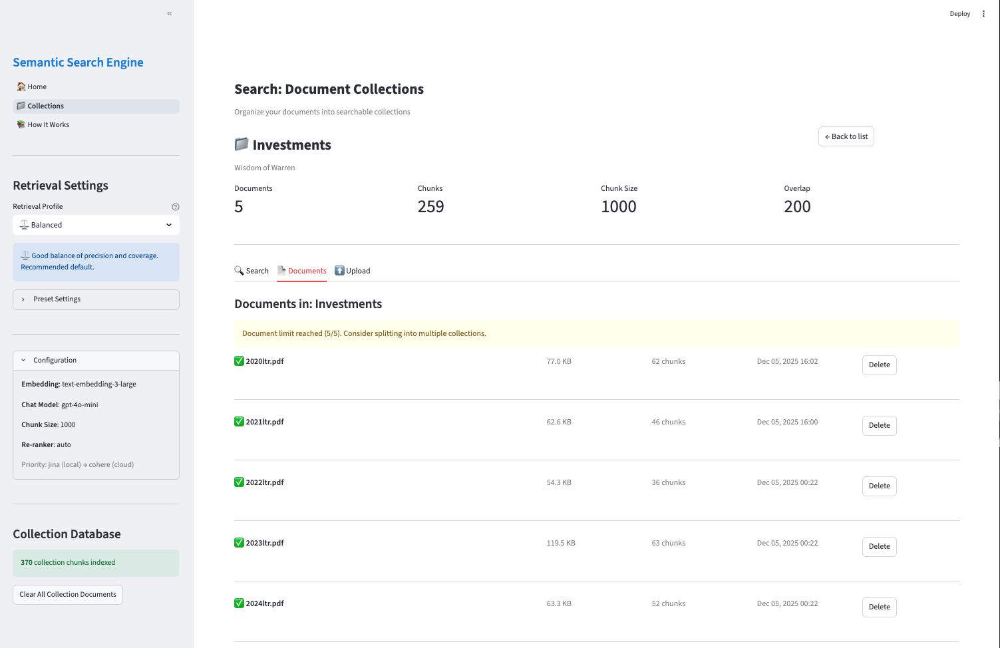
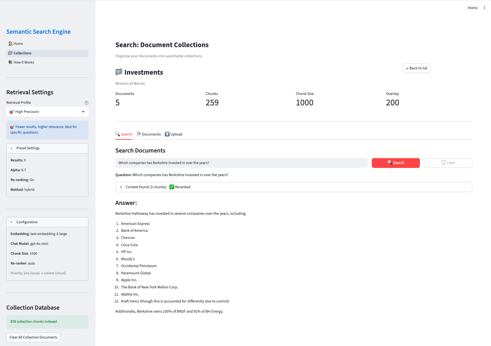

# 🔍 Semantic Search Engine

A RAG (Retrieval Augmented Generation) application built with LangChain, ChromaDB, and Streamlit. Upload PDF documents and ask natural language questions to retrieve contextually relevant answers powered by OpenAI.


## ✨ Features

### Core Features
- **📄 PDF Document Processing**: Upload and parse PDF files with automatic text extraction
- **🔗 Semantic Chunking**: Intelligent text splitting with configurable chunk sizes and overlap
- **🎯 Vector Embeddings**: High-quality embeddings using OpenAI text-embedding-3-large
- **💾 Persistent Vector Store**: ChromaDB for efficient similarity search with disk persistence
- **💬 Natural Language Queries**: Ask questions in plain language about your documents
- **✨ Contextual Answers**: GPT-4o-mini generates answers based solely on document content
- **🔄 Real-time Streaming**: Token-by-token answer generation for responsive UX
- **🔃 Document Persistence**: Uploaded documents persist across app restarts

### Navigation & UI
- **🧭 Sidebar Navigation**: Quick access to all pages (Search, How It Works, Collections)
- **📄 Documents Panel**: View document statistics (chunks, size, overlap) and list all uploaded documents on the home page
- **🎨 Consistent Branding**: Unified styling and navigation across all pages
- **📱 Responsive Layout**: Works well on different screen sizes

### Collection Management
- **📁 Document Collections**: Organize documents into searchable collections
- **🎯 Scoped Search**: Search within specific collections or across all documents
- **📊 Collection Stats**: Track document counts and chunk counts per collection
- **⚙️ Per-Collection Settings**: Configure chunk size and overlap per collection
- **🗑️ Cascade Deletion**: Deleting a collection removes all associated documents and chunks
- **🔄 Duplicate Detection**: Prevents uploading the same document twice to a collection
- **📝 Search History**: Per-collection search results persist during session navigation

### Advanced Retrieval
- **🔀 Hybrid Search**: Combine semantic (vector) and BM25 (keyword) search with RRF fusion
- **🎛️ Retrieval Presets**: Pre-configured profiles accessible from the sidebar dropdown:
  - 🎯 **High Precision**: Fewer, highly relevant results (k=3, alpha=0.7, reranking on)
  - ⚖️ **Balanced**: Good mix of precision and recall (k=5, alpha=0.5, reranking on)
  - 🔍 **High Recall**: More results, broader coverage (k=10, alpha=0.3, reranking off)
- **🏆 Re-ranking**: Cross-encoder re-ranking with configurable provider:
  - **Jina** (local): No API key needed, no latency - requires `sentence-transformers`
  - **Cohere** (cloud): Fast API, excellent quality - requires `COHERE_API_KEY`
  - **Auto mode** (default): Tries Jina (local) first, falls back to Cohere (cloud)
  - **Override**: Set `provider: "cohere"` in config.yaml to force cloud API
- **📊 Score Visibility**: View semantic, BM25, and rerank scores for each result

### User Experience
- **💬 Conversation History**: Context-aware follow-up questions within sessions
- **🧪 A/B Testing Framework**: Compare all 4 retrieval methods (semantic, BM25, hybrid, hybrid+rerank) with a single click
- **📋 Duplicate Detection**: Automatic check before uploading already-indexed PDFs
- **📊 Context Transparency**: View exactly which document chunks were used for answers

### Developer Experience
- **🛡️ Robust Error Handling**: Automatic retry logic with exponential backoff for API resilience
- **📝 Structured Logging**: Comprehensive logging for debugging and monitoring
- **⚙️ YAML Configuration**: Easily customizable settings without code changes
- **🎨 Modular Architecture**: Clean separation of concerns for maintainability
- **🧪 Comprehensive Test Suite**: 290+ unit and integration tests

## 📸 Screenshots

### Search Page

Upload PDFs and view your document library with statistics:



### Semantic Search with Answers

Ask questions and get AI-generated answers with source context:



### Context Chunks with Scores

View retrieved chunks with semantic and rerank scores:



---

### Collection Management

Organize documents into searchable collections:



### Documents in a Collection

View and manage documents within a collection:



### Collection Search

Search within a specific collection for focused results:



---

### How It Works - Interactive Documentation

The app includes a comprehensive "How It Works" page with interactive guides:

| Guide | Description | Screenshot |
|-------|-------------|------------|
| **Retrieval Methods** | Semantic, BM25, and hybrid search explained | [View](screenshots/HowItWorks_Retrieval.png) |
| **Precision vs Recall** | Trade-offs and preset configurations | [View](screenshots/HowItWorks_Precision_Recall.png) |
| **Collections** | How to organize documents effectively | [View](screenshots/HowItWorks_Collections.png) |
| **A/B Testing** | Compare retrieval methods empirically | [View](screenshots/HowItWorks_ABTesting.png) |
| **Configuration** | All settings explained with examples | [View](screenshots/HowItWorks_ConfigurationGuide.png) |
| **Conversation History** | Context-aware follow-up questions | [View](screenshots/HowItWorks_ConversationHistory.png) |

## 🏗️ Architecture

### Project Structure

```
semantic-search/
├── app.py                      # Streamlit UI application
├── config.yaml                 # Centralized configuration
├── config_loader.py            # Configuration management
├── core/                       # Core business logic
│   ├── __init__.py
│   ├── document_processor.py   # PDF loading and chunking
│   ├── vector_store.py         # ChromaDB management
│   ├── qa_chain.py             # Question answering pipeline
│   ├── hybrid_retriever.py     # Hybrid search (BM25 + Semantic)
│   ├── bm25_retriever.py       # BM25 keyword search
│   ├── reranker.py             # Cohere/Jina re-ranking
│   ├── conversation.py         # Conversation history management
│   ├── ab_testing.py           # A/B testing framework
│   ├── collection_manager.py   # Collection CRUD operations
│   ├── document_manager.py     # Document CRUD operations
│   ├── search_manager.py       # Unified search interface
│   ├── storage.py              # JSON file persistence
│   └── models/                 # Data models
│       ├── collection.py       # Collection model
│       ├── document.py         # Document model
│       ├── search.py           # Search request/response models
│       ├── responses.py        # API response models
│       └── errors.py           # Custom exceptions
├── pages/                      # Streamlit multi-page app
│   ├── 1_How_It_Works.py       # Interactive documentation
│   └── 2_Collections.py        # Collection management UI
├── ui/                         # Shared UI components
│   ├── __init__.py
│   ├── shared_components.py    # Branding, navigation, CSS
│   └── sidebar_components.py   # Retrieval settings, config display
├── utils/                      # Utility functions
│   ├── __init__.py
│   └── retry_utils.py          # API retry decorators
├── tests/                      # Test suite
│   ├── conftest.py             # pytest fixtures
│   └── test_*.py               # Unit and integration tests
├── data/                       # Data storage
│   ├── collections.json        # Collection metadata
│   └── documents.json          # Document metadata
├── screenshots/                # Application screenshots
├── pytest.ini                  # pytest configuration
├── requirements.txt            # Python dependencies
├── HOW_IT_WORKS.md             # Detailed technical documentation
├── .env.example                # Environment variables template
├── .gitignore                  # Git ignore rules
└── README.md                   # This file
```

### RAG Pipeline

```
┌──────────────┐
│  PDF Upload  │
└──────┬───────┘
       │
       ▼
┌─────────────────┐
│ Document        │
│ Processor       │ (PDF → Pages → Chunks)
└────────┬────────┘
         │
         ▼
┌─────────────────┐
│ Vector Store    │
│ Manager         │ (Chunks → Embeddings → ChromaDB)
└────────┬────────┘
         │
         ▼
┌─────────────────┐
│ User Question   │
└────────┬────────┘
         │
         ▼
┌─────────────────┐
│ Hybrid          │
│ Retriever       │ (Semantic + BM25 → RRF Fusion)
└────────┬────────┘
         │
         ▼
┌─────────────────┐
│ Re-ranker       │
│ (Optional)      │ (Cross-encoder scoring)
└────────┬────────┘
         │
         ▼
┌─────────────────┐
│ QA Chain        │ (Context → GPT-4o-mini → Answer)
└────────┬────────┘
         │
         ▼
┌─────────────────┐
│ Streamed Answer │
└─────────────────┘
```

## 📋 Prerequisites

- Python 3.8 or higher
- OpenAI API key ([Get one here](https://platform.openai.com/api-keys))
- 2GB+ free disk space (for ChromaDB vector store)

### Optional Dependencies
- **sentence-transformers** - For Jina re-ranker (local, preferred): `pip install sentence-transformers`
- **Cohere API key** ([Get one here](https://cohere.com/)) - For Cohere re-ranker (cloud fallback)
- The system prefers Jina (local) first, then falls back to Cohere (cloud) if Jina is unavailable

## 🚀 Installation

### 1. Clone the Repository

```bash
git clone https://github.com/shrimpy8/semantic-serach.git
cd semantic-serach
```

### 2. Create Virtual Environment

```bash
python -m venv venv
source venv/bin/activate  # On Windows: venv\Scripts\activate
```

### 3. Install Dependencies

```bash
pip install -r requirements.txt
```

### 4. Configure Environment Variables

```bash
# Copy the example environment file
cp .env.example .env

# Edit .env and add your API keys
OPENAI_API_KEY=your_openai_api_key_here
COHERE_API_KEY=your_cohere_api_key_here  # Optional - for Cohere reranker
```

**⚠️ SECURITY NOTE**: Never commit your `.env` file to version control. It's already in `.gitignore`.

## 💡 Usage

### Running the Application

```bash
streamlit run app.py
```

The application will open in your default browser at `http://localhost:8501`.

### Application Pages

The app has three main pages accessible via sidebar navigation:

| Page | Purpose |
|------|---------|
| **🔍 Search** | Upload documents and search (home page) |
| **📚 How It Works** | Interactive documentation and configuration guide |
| **📁 Collections** | Organize documents into searchable collections |

### Using the Search Page (Home)

1. **Upload PDF**: Click "Select a PDF file" and choose your document
2. **Wait for Processing**: The app extracts text, creates chunks, and generates embeddings
3. **View Documents Panel**: Expand to see document list and statistics (chunks, size, overlap)
4. **Select Retrieval Preset**: Choose High Precision, Balanced, or High Recall from sidebar
5. **Ask Questions**: Type your question in the chat input at the bottom
6. **View Scores**: Each result shows relevance scores (semantic, BM25, rerank)
7. **View Context**: Expand source sections to see the chunks used for the answer

### Managing Collections

1. **Navigate to Collections**: Click "📁 Collections" in the sidebar navigation
2. **Create a Collection**: Enter a name and optional description, then click "Create Collection"
3. **Upload Documents**: Select a collection, go to the "Upload" tab, and add PDF files
4. **View Documents**: See all documents in a collection with their status and chunk counts
5. **Search in Collection**: Use the "Search" tab to search within a specific collection
6. **Delete**: Remove individual documents or entire collections (cascade deletes all associated data)

### Retrieval Presets

| Preset | Results (k) | Alpha | Reranking | Best For |
|--------|-------------|-------|-----------|----------|
| 🎯 High Precision | 3 | 0.7 | On | Specific questions, exact answers |
| ⚖️ Balanced | 5 | 0.5 | On | General queries (default) |
| 🔍 High Recall | 10 | 0.3 | Off | Comprehensive research |

### A/B Testing

1. **Upload a document** on the Search page
2. **Expand the A/B Testing panel** (below Documents panel)
3. **Enter a test query** representative of real usage
4. **Click "Run Comparison"** - automatically tests all 4 methods:
   - Semantic (pure vector search)
   - BM25 (pure keyword search)
   - Hybrid (combined, no reranking)
   - Hybrid + Rerank (combined with reranking)
5. **View results**: Average score, latency, and recommended variant
6. **Export to CSV** for deeper analysis

## ⚙️ Configuration

All settings are managed in `config.yaml`. Customize without changing code:

### Model Configuration

```yaml
models:
  embedding:
    name: "text-embedding-3-large"  # OpenAI embedding model
  chat:
    name: "gpt-4o-mini"              # Chat model
    temperature: 0.0                 # 0.0 = deterministic
```

### Retrieval Presets

```yaml
retrieval_presets:
  high_precision:
    search_k: 3
    alpha: 0.7
    reranking: true
    description: "Fewer, highly relevant results"
  balanced:
    search_k: 5
    alpha: 0.5
    reranking: true
    description: "Good balance of precision and recall"
  high_recall:
    search_k: 10
    alpha: 0.3
    reranking: false
    description: "More results, broader coverage"
```

### Hybrid Retrieval

```yaml
hybrid_retrieval:
  enabled: true
  default_method: "hybrid"
  alpha: 0.5              # 0=BM25 only, 1=Semantic only
  rrf_k: 60               # RRF fusion constant

  bm25:
    k1: 1.5               # Term frequency saturation
    b: 0.75               # Length normalization

  reranking:
    enabled: true
    # Provider options:
    #   - "auto": jina (local) first, then cohere (cloud)
    #   - "jina": force local model
    #   - "cohere": force cloud API
    provider: "auto"
    fetch_k_multiplier: 3 # Fetch 3x candidates for reranking
```

### Document Processing

```yaml
document_processing:
  chunk_size: 1000        # Characters per chunk
  chunk_overlap: 200      # Overlap between chunks
  add_start_index: true   # Add metadata for chunk position
```

## 🛠️ Development

### Module Overview

| Module | Purpose |
|--------|---------|
| `core/document_processor.py` | PDF loading, text extraction, chunking |
| `core/vector_store.py` | ChromaDB management, similarity search |
| `core/hybrid_retriever.py` | BM25 + Semantic fusion with RRF |
| `core/reranker.py` | Cohere/Jina cross-encoder re-ranking |
| `core/qa_chain.py` | RAG pipeline, answer generation |
| `core/collection_manager.py` | Collection CRUD operations |
| `core/document_manager.py` | Document CRUD operations |
| `core/search_manager.py` | Unified search interface |
| `ui/shared_components.py` | Branding, navigation, shared CSS |
| `ui/sidebar_components.py` | Retrieval settings, configuration display |

### Testing

The project includes a comprehensive test suite with 290+ tests:

```bash
# Run all tests
pytest tests/ -v

# Run specific test categories
pytest tests/ -v -m unit         # Unit tests only
pytest tests/ -v -m integration  # Integration tests

# Test coverage
pytest tests/ --cov=. --cov-report=html
```

**Test Files:**
- `tests/test_models.py` - Data models (Collection, Document, Search)
- `tests/test_collection_manager.py` - Collection CRUD operations
- `tests/test_document_manager.py` - Document CRUD operations
- `tests/test_search_manager.py` - Search functionality
- `tests/test_vector_store.py` - ChromaDB operations
- `tests/test_hybrid_retriever.py` - Hybrid search logic
- `tests/test_ab_testing.py` - A/B testing framework
- `tests/test_conversation.py` - Conversation history
- `tests/test_config_loader.py` - Configuration loading

### Code Style

- Follow PEP 8 guidelines
- Comprehensive docstrings for all classes and functions
- Type hints for function parameters and returns
- Structured logging with `logging.getLogger(__name__)`

## 📝 Logging

Application logs are written to:
- **Console**: Real-time output during execution
- **File**: `semantic_search.log` (persistent logs)

Key log messages:
```
🔍 Auto-selecting reranker...
✅ RERANKER SELECTED: Jina (local)
# or if Jina unavailable:
✅ RERANKER SELECTED: Cohere (cloud)
```

Adjust logging level in `config.yaml`:
```yaml
logging:
  level: "INFO"  # DEBUG, INFO, WARNING, ERROR, CRITICAL
```

## 🔒 Security

### API Key Management

1. **Never commit** `.env` files to version control
2. **Rotate keys immediately** if accidentally exposed
3. **Use environment variables** for all sensitive data
4. **Review** `SECURITY_NOTICE.md` for detailed security guidelines

### Pre-commit Hook

Add to `.git/hooks/pre-commit`:

```bash
#!/bin/bash
if git diff --cached --name-only | grep -E '\\.env$'; then
    echo "❌ ERROR: Attempting to commit .env file!"
    exit 1
fi
exit 0
```

Make executable:
```bash
chmod +x .git/hooks/pre-commit
```

## 🐛 Troubleshooting

### Common Issues

**Error: "Configuration file not found"**
- Ensure `config.yaml` exists in the project directory
- Check file permissions

**Error: "OpenAI API key not found"**
- Verify `.env` file exists with valid `OPENAI_API_KEY`
- Ensure `python-dotenv` is installed

**Error: "Rate limit exceeded"**
- Wait for rate limit reset
- Retry logic should handle this automatically
- Check API quota/billing

**No reranker available**
- Install `sentence-transformers` for Jina (preferred): `pip install sentence-transformers`
- Or add `COHERE_API_KEY` to `.env` for Cohere (cloud fallback)

**Documents lost after restart**
- This is now fixed - documents persist automatically
- If issue persists, check ChromaDB connection

**ChromaDB Permission Error**
- Ensure write permissions for `./chroma/db` directory
- Try deleting the directory and restarting

## 📚 How It Works

### 1. Document Upload & Processing

When you upload a PDF:
1. File is temporarily saved to disk
2. PyPDFLoader extracts text from all pages
3. RecursiveCharacterTextSplitter creates overlapping chunks
4. Temporary file is cleaned up

### 2. Embedding & Indexing

For each chunk:
1. OpenAI text-embedding-3-large generates 3072-dimension vector
2. Vector + metadata stored in ChromaDB
3. Collection persisted to disk for future sessions

### 3. Retrieval (Hybrid Search)

When you search:
1. Query processed through both semantic and BM25 retrievers
2. Results combined using Reciprocal Rank Fusion (RRF)
3. Alpha parameter controls the balance (configurable via presets)
4. Optional: Cross-encoder re-ranking for improved quality

### 4. Answer Generation

After retrieval:
1. Top-K chunks formatted as context
2. GPT-4o-mini generates answer based solely on context
3. Answer streamed token-by-token to UI
4. Source chunks displayed with relevance scores

## 💡 Tips for Better Results

- ✅ Choose the right preset: High Precision for specific queries, High Recall for research
- ✅ Upload well-structured PDFs with clear text (avoid scanned images)
- ✅ Use the A/B testing framework to find optimal settings for your documents
- ✅ Check relevance scores to understand result quality
- ✅ Use Collections to organize documents by topic/project
- ✅ Enable reranking for important queries (at the cost of some latency)

## 🚧 Limitations

- **PDF Only**: Currently supports PDF files only (no DOCX, TXT, etc.)
- **Text Extraction**: Quality depends on PDF structure (scanned PDFs won't work)
- **Context Window**: Limited to top-K chunks (may miss relevant information)
- **English Focused**: Best performance with English documents
- **Local Storage**: Vector store persisted locally (not suitable for multi-user production)

## 🗺️ Roadmap

**Completed** ✅:
- [x] Hybrid search (BM25 + semantic) with RRF fusion
- [x] Re-ranking support (Cohere cloud + Jina local) with auto-selection
- [x] Conversation history and follow-up questions
- [x] Retrieval presets (High Precision / Balanced / High Recall)
- [x] Score visibility for search results
- [x] A/B testing framework for retrieval methods
- [x] Interactive "How It Works" documentation page
- [x] Multi-document collections with isolated searches
- [x] Sidebar navigation across all pages
- [x] Documents panel on home page
- [x] Per-collection search history persistence
- [x] Shared UI components (DRY refactoring)
- [x] Comprehensive test suite (290+ tests)
- [x] Document persistence across app restarts

**Future enhancements planned**:
- [ ] Support for multiple file formats (DOCX, TXT, HTML, Markdown)
- [ ] Document similarity and comparison features
- [ ] Export search results to CSV/JSON
- [ ] Advanced chunking strategies (sentence-based, semantic)
- [ ] Citation tracking (show exact page/paragraph references)
- [ ] Docker containerization
- [ ] Next.js production UI (Stage 2)
- [ ] FastAPI backend with Supabase (Stage 2)
- [ ] User authentication and multi-user support

## 🤝 Contributing

Contributions are welcome! Please:

1. Fork the repository
2. Create a feature branch (`git checkout -b feature/amazing-feature`)
3. Commit your changes (`git commit -m 'Add amazing feature'`)
4. Push to the branch (`git push origin feature/amazing-feature`)
5. Open a Pull Request

## 📄 License

This project is licensed under the MIT License - see the LICENSE file for details.

## 🙏 Acknowledgments

- [LangChain](https://github.com/langchain-ai/langchain) - LLM application framework
- [ChromaDB](https://www.trychroma.com/) - Vector database
- [Streamlit](https://streamlit.io/) - Web application framework
- [OpenAI](https://openai.com/) - Embeddings and chat models
- [Cohere](https://cohere.com/) - Re-ranking API
- [Jina AI](https://jina.ai/) - Local re-ranking models

## 👤 Author

**Harsh**
- GitHub: [@shrimpy8](https://github.com/shrimpy8)
- Repository: [semantic-serach](https://github.com/shrimpy8/semantic-serach)

## 📞 Support

If you encounter any issues or have questions:
1. Check the [Troubleshooting](#-troubleshooting) section
2. Review existing [GitHub Issues](https://github.com/shrimpy8/semantic-serach/issues)
3. Create a new issue with detailed description

---

**Made with ❤️ using LangChain, ChromaDB, and OpenAI**
