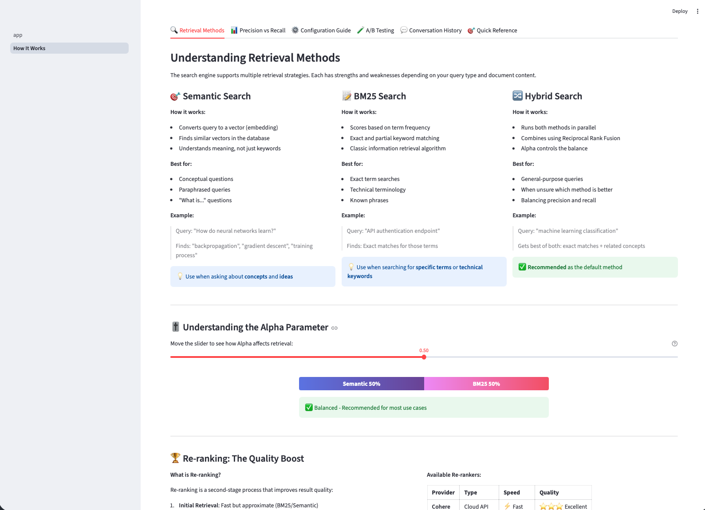
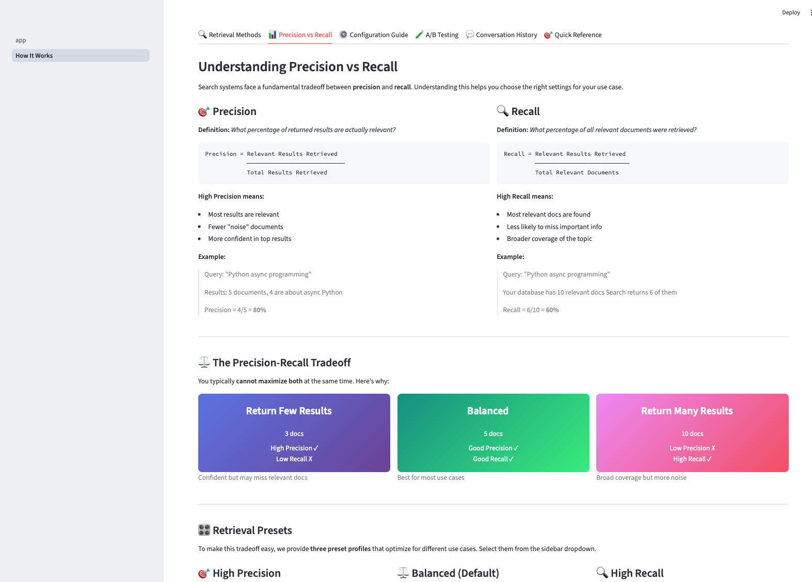
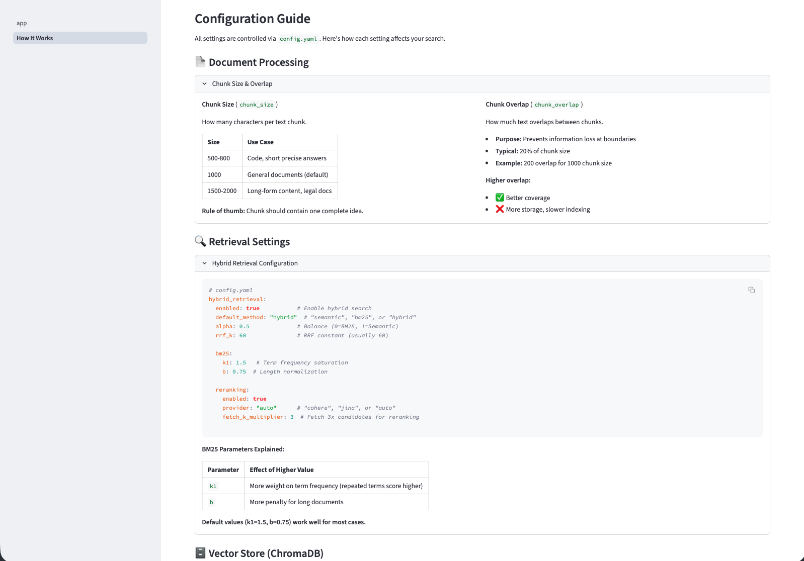
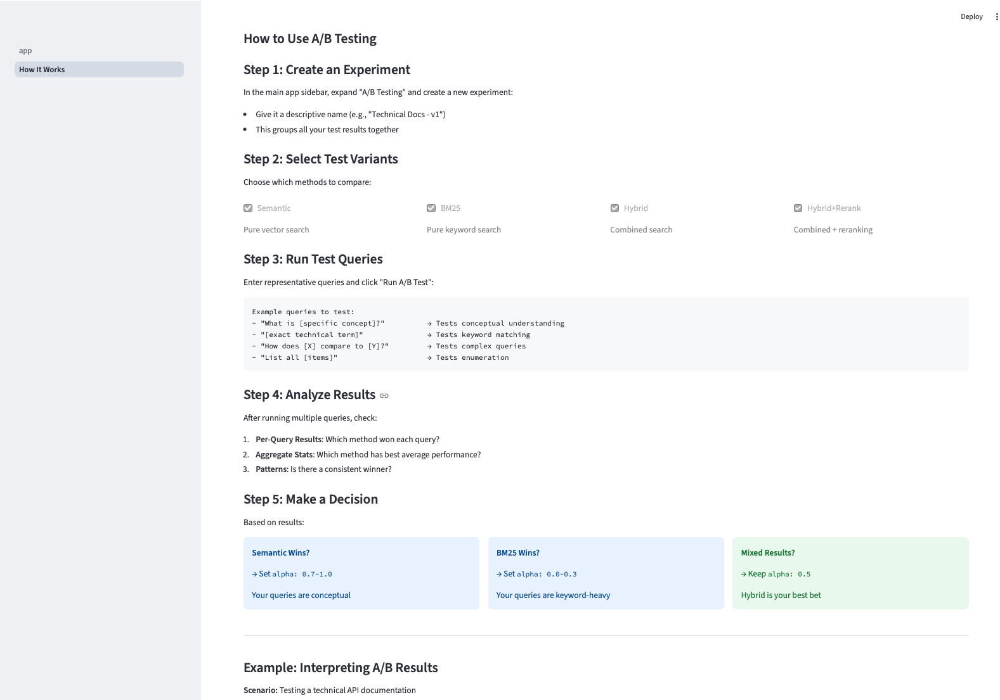
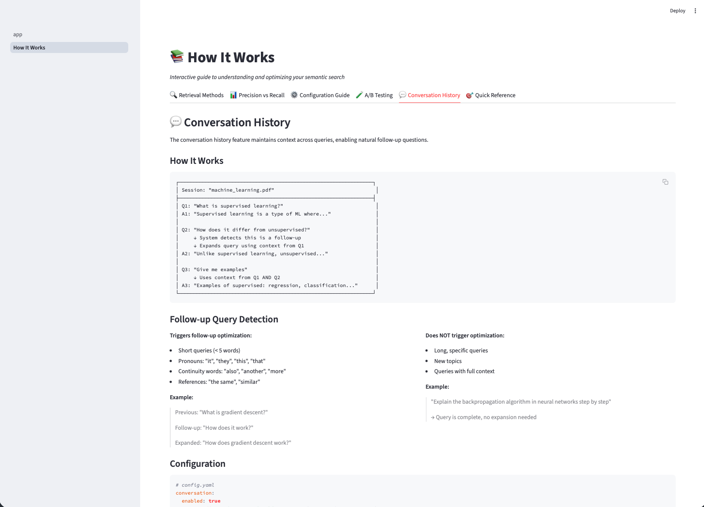
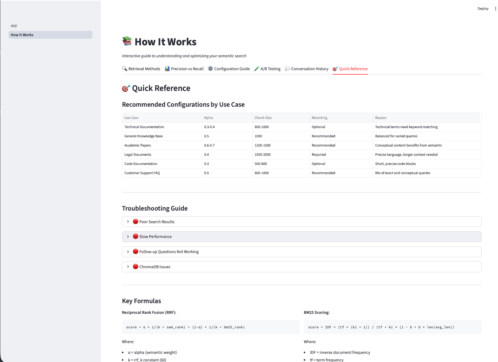

# Interactive Documentation Screenshots

This page showcases the "How It Works" interactive documentation built into the Semantic Search Engine.

Access this documentation anytime by clicking **"Learn more about optimizing your semantic search"** in the main app, or navigate to the "How It Works" page.

---

## Retrieval Methods

Understanding the three retrieval strategies: Semantic Search, BM25, and Hybrid Search.

**Key concepts covered:**
- Semantic search (vector-based) for conceptual questions
- BM25 search (keyword-based) for exact term matching
- Hybrid search combining both methods with RRF fusion
- Interactive alpha parameter demonstration

---

## Precision vs Recall

Understanding the fundamental tradeoff in search systems and how to optimize for your use case.

**Key concepts covered:**
- Precision: What percentage of returned results are relevant
- Recall: What percentage of all relevant documents were retrieved
- The precision-recall tradeoff visualization
- Three retrieval presets: High Precision, Balanced, High Recall
- When to use each preset
- Understanding relevance scores

---

## Configuration Guide

Deep dive into all configuration options and their effects on search quality.

**Key concepts covered:**
- Document processing settings (chunk size, overlap)
- Hybrid retrieval configuration
- BM25 parameters (k1, b) explained
- Re-ranking options (Cohere vs Jina)
- ChromaDB Docker vs local mode

---

## A/B Testing Framework

Empirically compare retrieval methods to find the best configuration for your documents.

**Key concepts covered:**
- Creating experiments
- Running comparisons across methods
- Understanding metrics (latency, scores, variance)
- Interpreting results
- Making data-driven configuration decisions

---

## Conversation History

Context-aware follow-up questions and session management.

**Key concepts covered:**
- How conversation context works
- Follow-up query optimization
- Session management
- Configuration options
- Tips for better conversations

---

## Quick Reference

Cheat sheets and troubleshooting guides for common scenarios.

**Key concepts covered:**
- Recommended configurations by use case
- Troubleshooting common issues
- Key formulas (RRF, BM25)
- Environment variables reference

---

## Back to Main Documentation

- [README](../README.md) - Main project documentation
- [HOW_IT_WORKS.md](../HOW_IT_WORKS.md) - Detailed technical documentation
